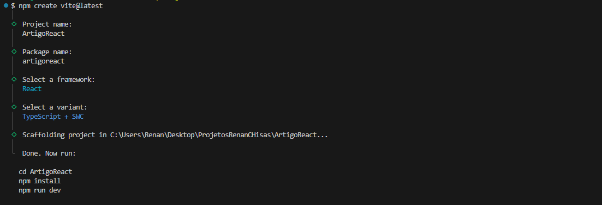
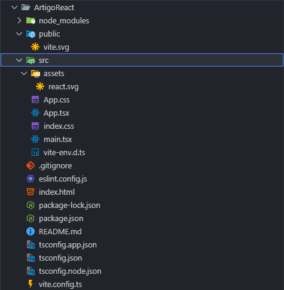
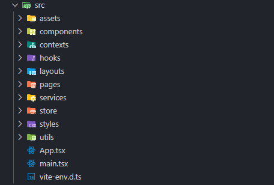

# React v19.1.0 + Vite e Suas Funcionalidades

Neste artigo, compartilho todo o meu conhecimento sobre o **React v19.1.0 + Vite**, destacando boas práticas, ferramentas úteis e estruturação de projetos modernos. O conteúdo está organizado em tópicos para facilitar o aprendizado e a aplicação prática.

⚠️ **Pré-requisitos**: Este artigo assume que você já possui conhecimentos prévios em **HTML**, **CSS**, **JavaScript** e também em **Node.js**. Caso ainda não esteja familiarizado com esses tópicos, recomendo estudá-los antes de prosseguir para um melhor aproveitamento do conteúdo.

**Obs:** Caso você tenha alguma sugestão para mudanças, entre em contato.

## Índice

- [React v19.1.0 + Vite e Suas Funcionalidades](#react-v1910--vite-e-suas-funcionalidades)
  - [Índice](#índice)
  - [Inicialização e Criação do Projeto](#inicialização-e-criação-do-projeto)
  - [Estrutura de pastas e organização](#estrutura-de-pastas-e-organização)
    - [Descrição das pastas e arquivos](#descrição-das-pastas-e-arquivos)
  - [Roteamento com React Router](#roteamento-com-react-router)
    - [Em produção ainda](#em-produção-ainda)

## Inicialização e Criação do Projeto

Para iniciar um novo projeto React utilizando o [Vite](https://vite.dev/guide/), execute o comando abaixo no terminal:

```bash
npm create vite@latest
```

Com isso basta defenir as propriedades pedidas



## Estrutura de pastas e organização

Por padrão, o Vite cria uma estrutura de pasta da seguinte forma:



Porém, essa não é uma maneira muito organizada e adequada, então, alterando, fica da seguinte forma:



---

### Descrição das pastas e arquivos

- **public/**  
  Arquivos estáticos acessíveis diretamente, como favicon e imagens.

- **src/**  
  Diretório principal do código-fonte da aplicação.

  - **assets/**  
    Imagens, fontes, ícones e estilos (CSS/SASS).

  - **components/**  
    Componentes pequenos e reutilizáveis, como botões, cards, inputs.

  - **layouts/**  
    Componentes de layout que estruturam a interface, como cabeçalho, rodapé e sidebar.

  - **pages/**  
    Páginas ou views da aplicação, que compõem as telas principais.

  - **hooks/**  
    Custom hooks do React para lógica reutilizável.

  - **contexts/**  
    Context API para gerenciamento de estado global.

  - **services/**  
    Serviços externos, chamadas a APIs e lógica de acesso a dados.

  - **utils/**  
    Funções utilitárias usadas em diferentes partes do projeto.

  - **store/**  
    Gerenciamento de estado com bibliotecas específicas (Redux, Zustand, etc).

  - **App.jsx**  
    Componente principal da aplicação.

  - **main.jsx**  
    Arquivo de entrada que inicializa o React e monta a aplicação.

- **index.html**  
  Página HTML base para o Vite.

- **package.json**  
  Configurações e dependências do projeto.

- **vite.config.js**  
  Configuração do Vite.

- **.gitignore**  
  Arquivos e pastas ignorados pelo Git.

**Obs:** Neste artigo não serão abordados todos os arquivos e pastas, mas para mostrar que eles existem, já foram adicionados.

## Roteamento com React Router

### Em produção ainda
